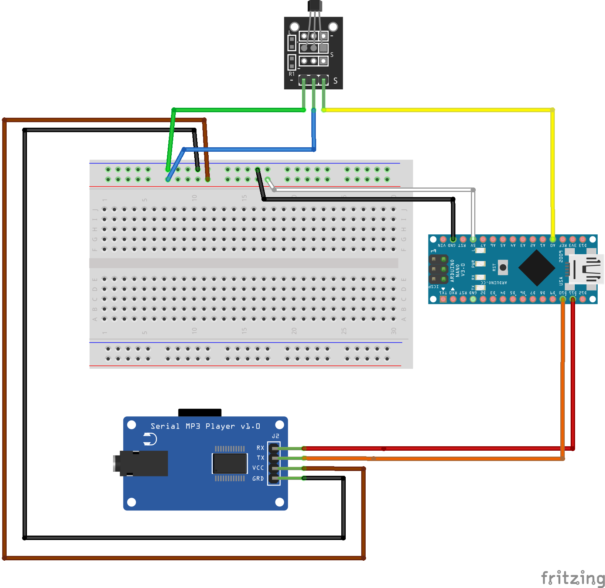

# Arduino Scooter Audio Feedback System

An Arduino-based project designed to enhance safety and awareness for electric scooters through dynamic audio feedback based on motion states detected by a Hall effect sensor.

---

## Hardware Setup

### Components Used

- **Arduino Nano**: Microcontroller to process sensor data and control the MP3 player.
- **Serial MP3 Player Module**: GD3300D for playing audio files stored on an SD card.
- **Hall Effect Sensor (Analog)**: SS49E or similar, to detect magnetic field intensity.
- **Speaker System**: For audio output via the MP3 player module.

### Circuit Diagram

[

### Connections

| **Component**     | **Arduino Pin**    | **Details**                                |
|--------------------|--------------------|--------------------------------------------|
| Hall Sensor (OUT)  | A0                | Reads analog data from the sensor          |
| MP3 Player RX      | D10               | Serial communication with MP3 player RX    |
| MP3 Player TX      | D11               | Serial communication with MP3 player TX    |
| MP3 Player GND     | GND               | Ground connection                          |
| MP3 Player VCC     | 5V                | Power supply                               |

---

## Features

- **Dynamic Audio Feedback**: Sounds change based on motion detected by the Hall sensor.
- **Modular Design**: Easily customizable to add more states or adjust audio files.
- **Realistic Simulation**: Acceleration and deceleration transitions closely mimic real scooter dynamics.

---

## Overview

This project simulates the sound feedback of an electric scooter using an **Arduino Nano**, a **Hall effect sensor**, and an **MP3 player module**. The system plays specific sound files corresponding to the following states:

- **Start**: Plays a startup sound when the system powers on.
- **Idle**: Plays a continuous idle sound when the scooter is stationary.
- **Acceleration**: Plays an acceleration sound when the scooter starts moving.
- **Deceleration + Idle**: Plays a combined sound for deceleration and transitioning back to idle after acceleration.

The goal is to simulate realistic scooter behavior while providing audio cues for enhanced safety and visibility in traffic.

---

## How It Works

### Workflow

1. **Start State**: When the system powers on, it plays a startup sound (`001.mp3`) for 4 seconds and transitions to the idle state.
2. **Idle State**: The system continuously plays the idle sound (`002.mp3`) in a loop. 
    - **Transition to Acceleration**: If the Hall sensor detects a strong magnetic field (`sensorValue > DECEL_THRESHOLD`), the system transitions to the acceleration state.
3. **Acceleration State**: Plays the acceleration sound (`003.mp3`) for 56 seconds or until the sensor detects no field (`sensorValue <= DECEL_THRESHOLD`).
    - **Transition to Deceleration**: After the acceleration sound ends, the system transitions to deceleration and idle (`006.mp3`).
4. **Deceleration + Idle State**: Plays a combined deceleration and idle sound (`006.mp3`), lasting 51.8 seconds. If a new acceleration is detected during this state, the system interrupts the sound and transitions back to acceleration.

---

## Code Explanation

### Key Sections

- **Sound States**: The project uses an enum (`SoundState`) to manage four states: START, IDLE, ACCEL, and DECEL_IDLE.
- **Track Durations**: Predefined durations for each sound track are stored in an array (`trackDuration[]`).
- **State Transitions**:
  - Transitions between states are triggered by conditions based on the Hall sensor's analog values.
  - Smooth transitions are ensured using timers (`millis()`).
- **Dynamic Interruptions**:
  - If a deceleration sound is playing and acceleration is detected, the deceleration sound stops, and the acceleration sound starts immediately.

### Code Walkthrough

1. **Initialization (`setup`)**:
   - The MP3 player is initialized, and the startup sound is played.

2. **Main Loop (`loop`)**:
   - The program continuously reads sensor data and manages state transitions.
   - Each state handles its specific behavior (playing sounds, checking conditions, etc.).

3. **Hall Sensor Readings**:
   - Values above 525 indicate no magnetic field (stationary).
   - Values below 525 indicate a magnetic field (movement).

4. **State Behavior**:
   - **Start**: Plays `001.mp3` and moves to idle.
   - **Idle**: Loops `002.mp3` and waits for acceleration.
   - **Acceleration**: Plays `003.mp3` and transitions to deceleration when completed.
   - **Deceleration + Idle**: Plays `006.mp3` and transitions back to idle when completed.

---

## Required Audio Files

Ensure the following MP3 files are correctly formatted and stored on the SD card:

| **File Name** | **Description**            | **Duration** |
|---------------|----------------------------|--------------|
| `001.mp3`     | Startup sound              | 4 seconds    |
| `002.mp3`     | Idle sound                 | 41 seconds   |
| `003.mp3`     | Acceleration sound         | 56 seconds   |
| `006.mp3`     | Deceleration + Idle sound  | 51.8 seconds |

---

## How to Run

1. Load the provided code onto your Arduino Nano.
2. Connect the circuit as shown in the diagram.
3. Power the system, and observe the sounds change dynamically based on the sensor values.

---

## Challenges Faced

- Difficulty with Hall sensor calibration and detecting transitions.
- Compatibility issues with the MP3 module due to incorrect libraries.
- Troubleshooting serial communication and ensuring smooth state transitions.

---

## Future Improvements

- Add an LCD display to show sensor values and current states.
- Introduce more complex sound feedback, such as variable pitch for acceleration.
- Optimize state management for faster transitions.

---

## License

This project is licensed under the MIT License. Feel free to use, modify, and distribute it.

---

If you encounter any issues or have suggestions, feel free to open an issue or submit a pull request!
